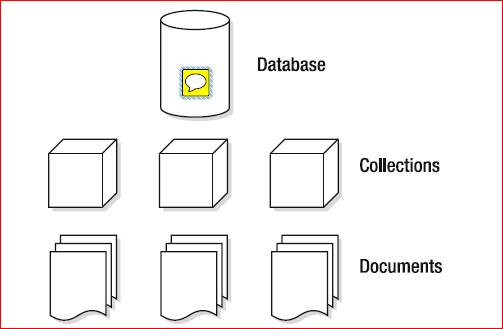

# MongoDbCRUD
CRUD mongodb with java

Very basic examples to interact with MongoDB NoSql database using java. 

For installation of MongoDB server: https://www.mongodb.com/download-center#community

## MongoDB data model 

## MongoDB replication 

## Run

First clone this app and start your mongod server. Then run the following command on the root folder of your cloned mongodb app:

 `mvn exec:java` (or just run the `fr.him.mongoSample.App` class from your IDE)
 
## Output 
 
